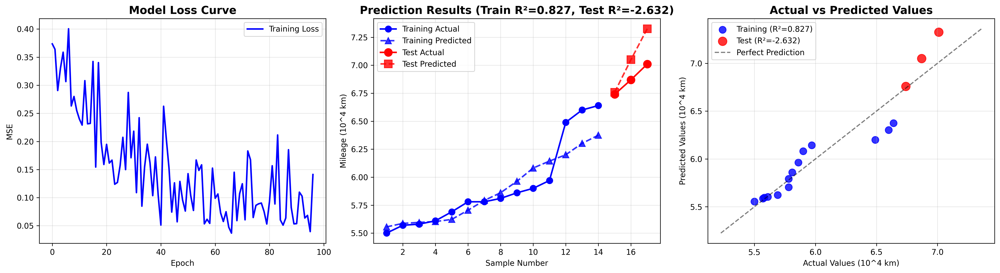
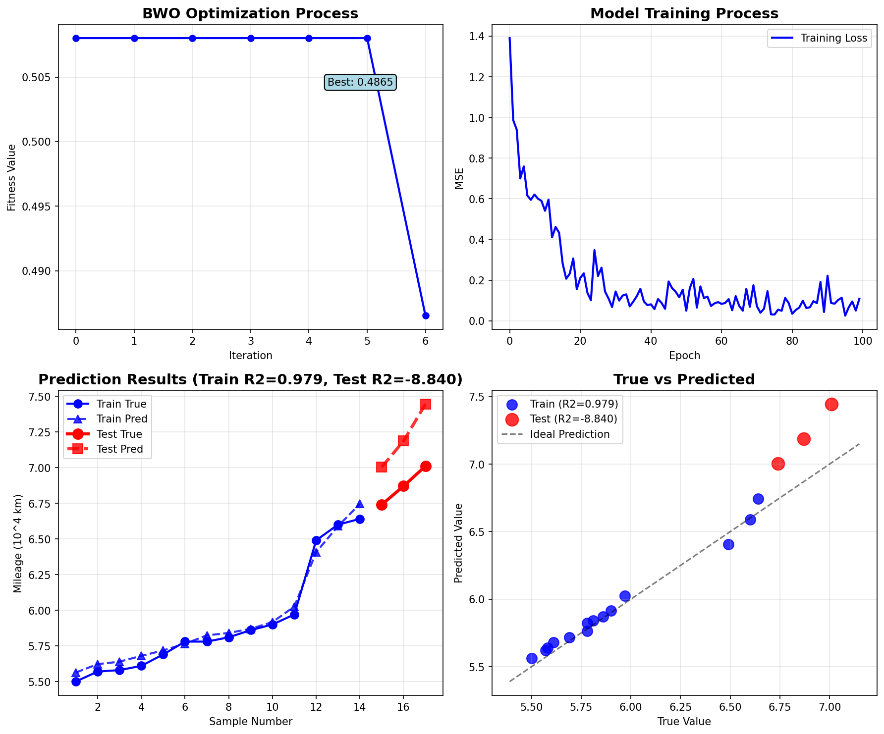

# WOA - CNN and BWO - CNN

基于**鲸鱼WOA/白鲸BWO优化算法**在CNN预测铁路里程数据上的应用。

开源地址：[lancitx/WW_CNN](https://github.com/lancitx/WW_CNN)

---

## 1. 预准备

- 原始数据：

```python
# 原始数据
data = np.array([
    [5.33, 5.39, 5.29, 5.41, 5.45, 5.50],
    [5.39, 5.29, 5.41, 5.50, 5.57, 5.57],
    [5.29, 5.41, 5.45, 5.50, 5.57, 5.58],
    [5.41, 5.45, 5.50, 5.57, 5.58, 5.61],
    [5.45, 5.50, 5.57, 5.58, 5.61, 5.69],
    [5.50, 5.57, 5.58, 5.61, 5.69, 5.78],
    [5.57, 5.58, 5.61, 5.69, 5.78, 5.78],
    [5.58, 5.61, 5.69, 5.78, 5.78, 5.81],
    [5.61, 5.69, 5.78, 5.78, 5.81, 5.86],
    [5.69, 5.78, 5.78, 5.81, 5.86, 5.90],
    [5.78, 5.78, 5.81, 5.86, 5.90, 5.97],
    [5.78, 5.81, 5.86, 5.90, 5.97, 6.49],
    [5.81, 5.86, 5.90, 5.97, 6.49, 6.60],
    [5.86, 5.90, 5.97, 6.49, 6.60, 6.64],
    [5.90, 5.97, 6.49, 6.60, 6.64, 6.74],
    [5.97, 6.49, 6.60, 6.64, 6.74, 6.87],
    [6.49, 6.60, 6.64, 6.74, 6.87, 7.01]
])
```

-  环境配置

配置虚拟环境：`Anaconda` + `pycharm`

```bash
# 新建一个conda环境，命名为CNN
conda create -n CNN python=3.8 -y
conda activate CNN

# 安装必要的软件包
pip install tensorflow==2.12.0  # 深度学习框架
pip install scikit-learn==1.2.2  # 数据预处理和标准化
pip install numpy==1.23.5  # 数值计算
pip install pandas==1.5.3  # 数据处理
pip install matplotlib==3.7.1  # 可视化，可选
pip install tqdm  # 进度条工具，可选
```

---

## 2. 实验

**纯CNN预测结果**：

```txt
=== Fixed CNN Time Series Prediction Model ===

Training set shape: (14, 5, 1)
Test set shape: (3, 5, 1)
Training data range: 5.500 - 6.640
Test data range: 6.740 - 7.010

Model: "sequential"
_________________________________________________________________
 Layer (type)                Output Shape              Param #   
=================================================================
 conv1d (Conv1D)             (None, 5, 16)             48        
                                                                 
 dropout (Dropout)           (None, 5, 16)             0         
                                                                 
 conv1d_1 (Conv1D)           (None, 5, 8)              264       
                                                                 
 global_max_pooling1d (Globa  (None, 8)                0         
 lMaxPooling1D)                                                  
                                                                 
 dense (Dense)               (None, 16)                144       
                                                                 
 dropout_1 (Dropout)         (None, 16)                0         
                                                                 
 dense_1 (Dense)             (None, 1)                 17        
                                                                 
=================================================================
Total params: 473
Trainable params: 473
Non-trainable params: 0
_________________________________________________________________

Starting training...

=== Model Evaluation Results ===
Training R²: 0.8268
Training MAPE: 0.02%
Test R²: -2.6323
Test MSE: 0.044153
Test MAE: 0.171344
Test MAPE: 0.02%

=== Prediction Results ===
Sample 15: Actual = 6.7400, Predicted = 6.7584, Error = 0.0184 (0.27%)
Sample 16: Actual = 6.8700, Predicted = 7.0497, Error = 0.1797 (2.62%)
Sample 17: Actual = 7.0100, Predicted = 7.3260, Error = 0.3160 (4.51%)

=== Model Diagnostics ===
Model complexity: 473 parameters
Overfitting indicator: 3.4591
⚠️  Warning: Possible overfitting detected!
```

训练效果：




**woa_cnn预测结果**：

```txt
=== 🚀 优化版 WOA-CNN 超参数搜索系统 ===

开始WOA超参数优化...
🐋 初始化鲸鱼群体...
鲸鱼 1: 适应度 = 0.6649
鲸鱼 2: 适应度 = 0.7295
鲸鱼 3: 适应度 = 1.2334
鲸鱼 4: 适应度 = 0.5080
鲸鱼 5: 适应度 = 0.9460
初始最优适应度: 0.508011
🔍 WOA优化进度:  17%|█▋        | 1/6 [00:07<00:36,  7.28s/it]第 1 代: 最优适应度 = 0.508011, 改进 3 个个体
🔍 WOA优化进度:  33%|███▎      | 2/6 [00:15<00:30,  7.55s/it]第 2 代: 最优适应度 = 0.404703, 改进 2 个个体
第 3 代: 最优适应度 = 0.404703, 改进 1 个个体
🔍 WOA优化进度:  67%|██████▋   | 4/6 [00:29<00:14,  7.27s/it]第 4 代: 最优适应度 = 0.404703, 改进 1 个个体
第 5 代: 最优适应度 = 0.404703, 改进 0 个个体
🔍 WOA优化进度: 100%|██████████| 6/6 [00:43<00:00,  7.25s/it]
第 6 代: 最优适应度 = 0.404703, 改进 1 个个体

✅ WOA优化完成!
最优超参数组合:
  - Conv1滤波器: 9
  - Conv2滤波器: 9
  - 全连接单元: 15
  - 学习率: 0.00388
  - Dropout率: 0.100
  - 最优适应度: 0.404703

🏋️ 开始训练最终模型...

📊 === 最终模型性能评估 ===
训练集:
  R² = 0.9894
  MSE = 0.001462
  MAE = 0.028399

测试集:
  R² = -7.2347
  MSE = 0.100097
  MAE = 0.315950

🎯 详细预测结果:
  样本15: 真实=6.7400, 预测=7.0335, 误差=0.2935 (4.4%)
  样本16: 真实=6.8700, 预测=7.1916, 误差=0.3216 (4.7%)
  样本17: 真实=7.0100, 预测=7.3427, 误差=0.3327 (4.7%)

🔍 模型诊断:
  过拟合指标: 8.2240
  模型复杂度: 410 参数
  ⚠️  轻微过拟合
图表已保存到: ../img/woa_cnn_optimized_results.png

🎉 WOA优化的最优超参数:
   Conv1滤波器: 9
   Conv2滤波器: 9
   全连接单元: 15
   学习率: 0.00388
   Dropout率: 0.100

🎉 优化完成！
```

训练效果：


**bwo_cnn预测效果**：

```txt
=== 🚀 优化版 BWO-CNN 超参数搜索系统 ===

开始BWO超参数优化...
🐳 初始化白鲸群体...
白鲸 1: 适应度 = 0.6649
白鲸 2: 适应度 = 0.7295
白鲸 3: 适应度 = 1.2334
白鲸 4: 适应度 = 0.5080
白鲸 5: 适应度 = 0.9460
初始最优适应度: 0.508011
🔍 BWO优化进度:  17%|█▋        | 1/6 [00:07<00:35,  7.16s/it]第 1 代: 最优适应度 = 0.508011, 改进 2 个个体
第 2 代: 最优适应度 = 0.508011, 改进 1 个个体
🔍 BWO优化进度:  50%|█████     | 3/6 [00:21<00:21,  7.19s/it]第 3 代: 最优适应度 = 0.508011, 改进 2 个个体
第 4 代: 最优适应度 = 0.508011, 改进 0 个个体
🔍 BWO优化进度:  83%|████████▎ | 5/6 [00:35<00:07,  7.03s/it]第 5 代: 最优适应度 = 0.508011, 改进 1 个个体
🔍 BWO优化进度: 100%|██████████| 6/6 [00:42<00:00,  7.04s/it]
第 6 代: 最优适应度 = 0.486518, 改进 3 个个体

✅ BWO优化完成!
最优超参数组合:
  - Conv1滤波器: 9
  - Conv2滤波器: 7
  - 全连接单元: 18
  - 学习率: 0.00441
  - Dropout率: 0.206
  - 最优适应度: 0.486518

🏋️ 开始训练最终模型...

📊 === 最终模型性能评估 ===
训练集:
  R² = 0.9790
  MSE = 0.002894
  MAE = 0.045870

测试集:
  R² = -8.8401
  MSE = 0.119612
  MAE = 0.338295

🎯 详细预测结果:
  样本15: 真实=6.7400, 预测=7.0034, 误差=0.2634 (3.9%)
  样本16: 真实=6.8700, 预测=7.1862, 误差=0.3162 (4.6%)
  样本17: 真实=7.0100, 预测=7.4453, 误差=0.4353 (6.2%)

🔍 模型诊断:
  过拟合指标: 9.8190
  模型复杂度: 349 参数
  ⚠️  轻微过拟合
图表已保存到: ../img/bwo_cnn_optimized_results.png

🎉 BWO优化的最优超参数:
   Conv1滤波器: 9
   Conv2滤波器: 7
   全连接单元: 18
   学习率: 0.00441
   Dropout率: 0.206

🎉 优化完成！
```

训练及预测效果：



